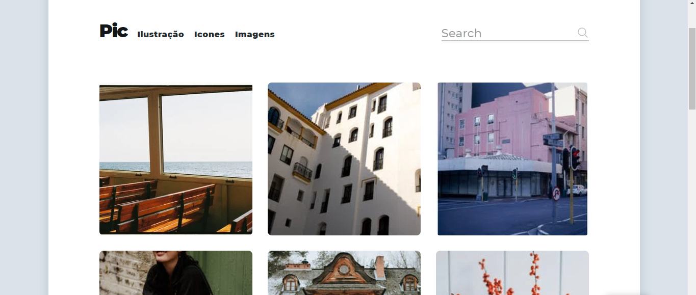
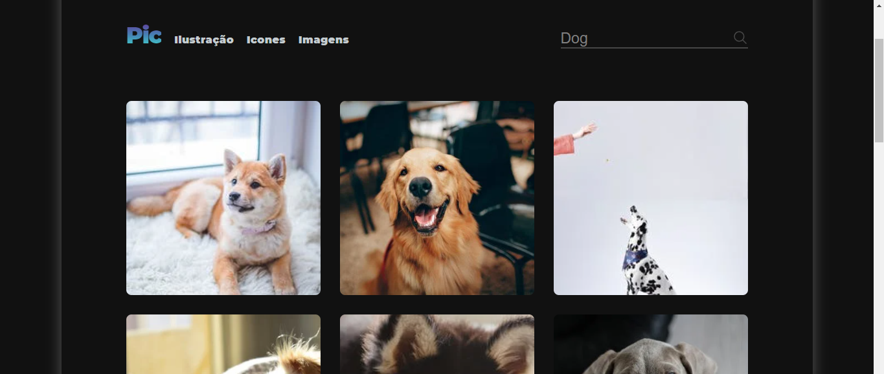
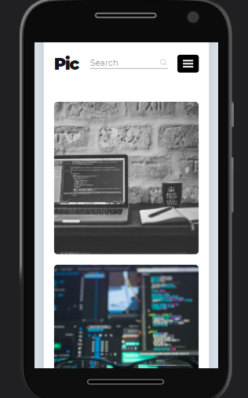
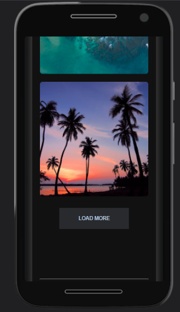

# Álbum de fotos​

## Demonstration

 

 

## 📋 About the project

- Galeria de fotos.
- Fotos carregadas através de um fetch na api pexels.
- Search.
- Layout modo light e dark mode.  

## Available Scripts
Apenas abra em qualquer navegador.

## 💻 Techs

* [ ] JavaScript
* [ ] HTML
* [ ] CSS

## Author

**Douglas D. Santos**

Encontre-me em [?&style=for-the-badge&logo=gmail&logoColor=white)](mailto:douglas.d.santos.dev@gmail.com) [.svg?&style=for-the-badge&logo=linkedin&logoColor=white)](https://www.linkedin.com/in/douglas-santos-8442b41ba/)

## 📕 License

Esse projeto está sob a licença MIT.
 
